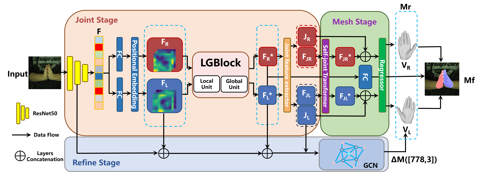

# LGNet
LGNet: Local-and-Global Feature Adaptive Network for 3D Interacting Hand Mesh Reconstruction



### Abstract
Accurate 3D interacting hand mesh reconstruction from RGB images is crucial for applications such as robotics, augmented reality (AR), and virtual reality (VR). Especially in the field of robotics, accurate interacting hand mesh reconstruction can significantly improve the accuracy and naturalness of human-robot interaction. This task requires accurate understanding of complex interactions between two hands and ensuring reasonable alignment of the hand mesh with the image. Recent Transformer-based methods directly utilise the features of the two hands as input tokens, ignoring the correlation between local and global features of the interacting hands, leading to hand ambiguity, self-obscuration and self-similarity problems.We propose LGNet, Local and Global Feature Adaptive Network, by decoupling the hand mesh reconstruction task into three stages: a joint stage for predicting hand joints; a mesh stage for predicting a rough hand mesh; and a refine stage for fine-tuning the mesh image alignment using an offset mesh.  LGNet enables high-quality fingertip-level mesh image alignment, effectively models the spatial relationship between two hands, and supports real-time prediction. Extensive quantitative and qualitative results on benchmark datasets show that LGNet outperforms state-of-the-art methods in terms of mesh accuracy and image alignment, and demonstrates strong generalisation capabilities in experiments on in-the-wild images. Our source code will be made available to the community.

#### Getting started

- Clone this repo.
```bash
git clone https://github.com/HaoWeiHsueh/LGNet
cd LGNet/main
```

- Install dependencies. (Python 3 + NVIDIA GPU + CUDA. Recommend to use Anaconda)
```bash
pip install -r requirements.txt
```

- Prepare the training and testing dataset. (https://mks0601.github.io/InterHand2.6M/)
